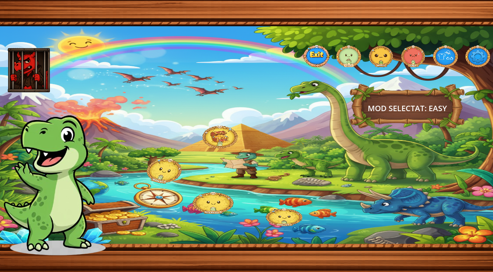
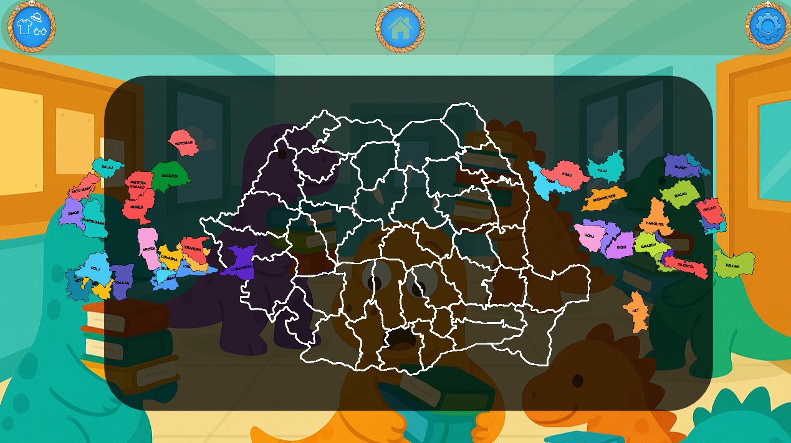
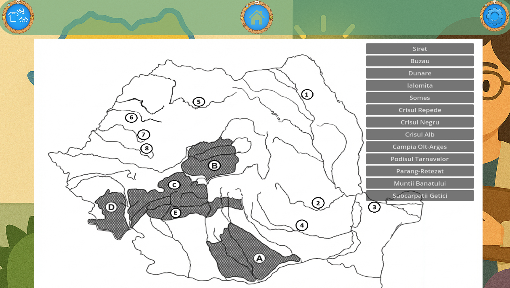

# Geography Learning App

An interactive 2D educational game for fourth-grade pupils to learn Romanian geography through play. Built with the Godot Engine as a mobile-first tablet application used during classroom sessions. Developed as a university team project at Babeș-Bolyai University in a team of 10.

## My Role

Contributed as **Backend Developer** and **Scrum Master**:

- Designed and built the **JSON-based data layer** storing game questions and level configurations, which drove cross-difficulty progression and dynamic scene management across all 12 games
- Coordinated the team of 10 as Scrum Master - ran sprint ceremonies, owned the product backlog, and maintained direct feedback loops with the client teacher and her pupils
- Translated user feedback into product decisions, including the treasure-chest reward for completing each difficulty tier and the expansion of game variety within levels

## About

Traditional geography lessons in Romanian primary schools often rely on blackboard-and-textbook methods. This app was built with a local fourth-grade teacher and her class as active partners, replacing rote memorization with tablet-based mini-games. Pupils play during class sessions, making learning interactive and fun.

## Screenshots


*Main menu — pupils select their difficulty level from here.*


*Medium Level 2: pupils drag Romanian counties into their correct positions on the map.*


*"Hartă mută" (blank map): pupils match numbered waters and cities and crosshatched geographical regions with their names. Immediate feedback on each match.*

## Features

- **12 educational games** across 3 difficulty levels (Easy, Medium, Hard)
- **4 games per level**, with the final game of each level being a special challenge round rewarded with a treasure chest
- **Progressive difficulty** — pupils advance through levels as they master content
- **Mobile-optimized** — designed for tablets used in classroom settings
- **Dynamic scene management** — smooth transitions between games and menus
- **JSON-driven content** — questions and configurations loaded from external data files for easy updates without code changes

## Game Structure

```
Easy Level              Medium Level            Hard Level
├── Game 1              ├── Game 5              ├── Game 9
├── Game 2              ├── Game 6              ├── Game 10
├── Game 3              ├── Game 7              ├── Game 11
└── Game 4 — Challenge  └── Game 8 — Challenge  └── Game 12 — Challenge
```

## Tech Stack

- **Engine:** Godot Engine 4.x
- **Language:** GDScript
- **Data:** JSON (questions, game configurations)
- **Version Control:** Git and GitHub

## How to Run

### Prerequisites
- [Godot Engine 4.x](https://godotengine.org/download)

### Steps

1. Clone the repository:
```bash
   git clone https://github.com/Nikolas5516/ioc-learning-app.git
```
2. Open Godot Engine
3. Click **Import** → navigate to the cloned folder → select `project.godot`
4. Click **Run** (F5) to launch the app

For mobile testing, use Godot's **Remote Debug** feature or export to Android.

## Team

Developed by a team of 10 at Babeș-Bolyai University. Project managed using Scrum methodology with regular sprint reviews and continuous stakeholder feedback from the client teacher and her fourth-grade class.
